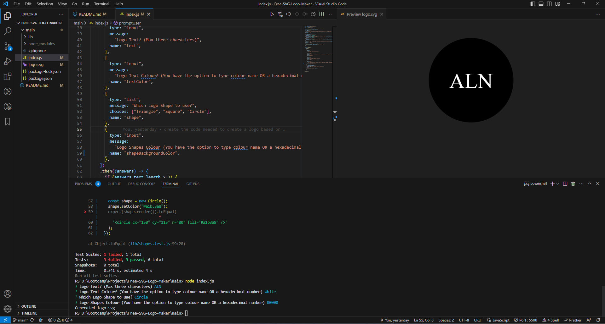
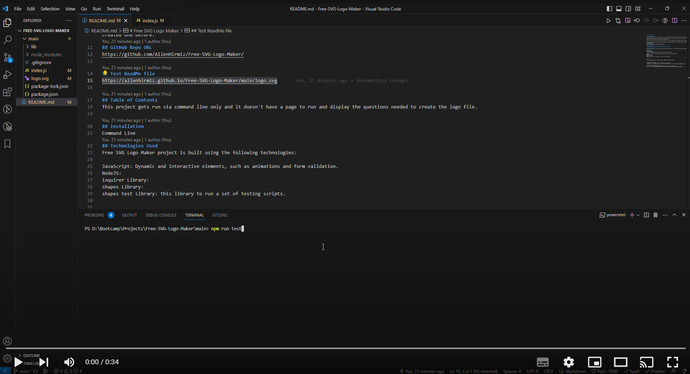

# Free SVG Logo Maker

## Free SVG Logo Maker
This repository was created to allow the users to create free simple logo for their new business, website or project based on 3 set of questions.

This project contain a few files but the files index.js contain the code to run and create a custom logo, this function is possible via nodeJS to allow the project to create files and in this project is to create logo.svg file based on set of questions.

This project is mainly focused on showing up my skills in JS with the integration of NodeJS libraries and improve on it as I progress my journey of learning full stack. 

The logo file name will be created based on the title name of max 3 characters, all logo files will be create with the same name so make sure you take a back up of the existed logo if you have created one before.
## GitHub Repo URL
https://github.com/AllenHirmiz/Free-SVG-Logo-Maker/

## Test ReadMe file
https://allenhirmiz.github.io/Free-SVG-Logo-Maker/main/logo.svg

## Table of Contents
This project gets run via command line only and it doesn't have a page to run and display the questions needed to create the logo file.

## Installation
Command Line
## Technologies Used
Free SVG Logo Maker project is built using the following technologies:

JavaScript: Dynamic and interactive elements, such as animations and form validation.
NodeJS:
inquirer Library: 
shapes Library:
shapes test Library: this library to run a set of testing scripts.

## Mock-Up

The following image shows the web application's appearance and functionality:

## Command line Screenshot
Screenshot of the command line that is needed to create logo file. 

## Command line file example video
Click on the screenshot to direct you the youtube video of a demo for this project.
